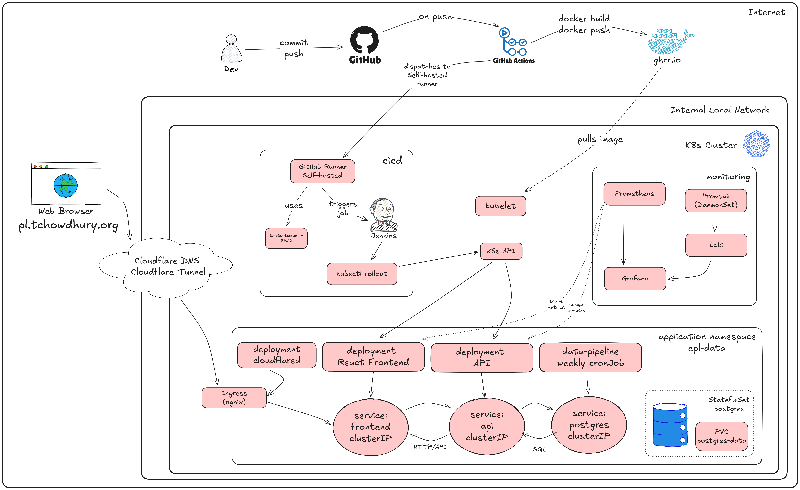
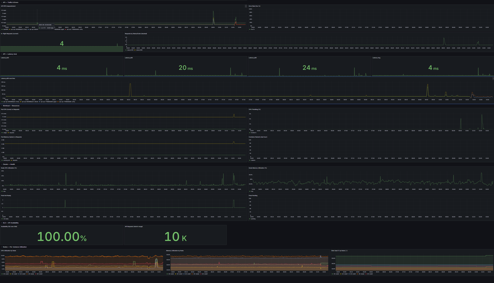

# EPL Data — Football Analytics 
## (Live at https://pl.tchowdhury.org)

End-to-end football analytics pipeline: **Understat & FBRef → ETL → PostgreSQL → Flask API → React dashboard**, deployed on **Kubernetes** with CI/CD, monitoring, and network policies.

> This README describes the system architecture and deployment choices.

---

## Live
- **App:** https://pl.tchowdhury.org

---

## Overview

- **Data**: Scraped from Understat and FBRef with a custom ETL process.
- **Database**: PostgreSQL 17 (StatefulSet + PVC).
- **API**: Flask service providing football data and Prometheus metrics.
- **Frontend**: React (Vite build, Nginx runtime).
- **CI/CD**: GitHub Actions builds/pushes images to GHCR. A self-hosted runner in the cluster triggers Jenkins to update deployments.
- **Ingress**: Cloudflare Tunnel (`cloudflared` pod).
- **Monitoring**: Prometheus Operator, Grafana, Loki + Promtail.
- **Security**: Non-root containers, seccomp, read-only filesystems where possible, Kubernetes NetworkPolicies.

---

## Architecture

---

## Frontend

- **Deployment**: `epl-react` (2 replicas)  
- **Service**: ClusterIP `:80` → pod `:8080` (Nginx)

**Key points**
- Readiness/liveness probes on `/`
- `runAsNonRoot`, `seccomp: RuntimeDefault`, `readOnlyRootFilesystem`
- Requests: `200m / 512Mi`; limits: `1 CPU / 1Gi`
- Waits for API readiness before start
- NetworkPolicy:
  - Ingress only from `cloudflared` on TCP 8080
  - Egress only to DNS + `epl-api:8000`

---

## Backend (API)

- **Deployment**: `epl-api` (2 replicas)  
- **Service**: ClusterIP `:8000`

**Key points**
- Config via `ConfigMap` + `Secret` (DB, pool sizes, pagination limits, CORS, optional token)
- Probes: `/health` (liveness), `/readyz` (readiness)
- Metrics: `/metrics` with Prometheus multiprocess
- Security: non-root, seccomp, read-only rootfs
- Init container waits for Postgres
- Requests: `500m / 512Mi`; limits: `1 CPU / 1Gi`
- NetworkPolicy:
  - Ingress from frontend + Prometheus
  - Egress to DNS + Postgres

**Prometheus**  
ServiceMonitor (15s scrape interval) on `/metrics`.

---

## Database

- **StatefulSet**: `postgres` (1 replica)  
- **Storage**: PVC on hostPath (demo/dev), Retain policy  
- **Services**: headless + client ClusterIP

**Key points**
- ConfigMap for tuning (buffers, WAL, autovacuum)
- Non-root UID/GID 999
- Probes via `pg_isready`
- Optional `fix-perms` init container
- Requests: `250m / 512Mi`; limits: `1 CPU / 2Gi`
- PodDisruptionBudget: minAvailable 1
- NetworkPolicy: ingress only from API + ETL

*Note: hostPath ties storage to one node. For HA, use CSI.*

---

## Data Pipeline (ETL)

- **Image**: `ghcr.io/tamhid92/epl-etl`  
- **Init Job**: `etl-init` (one-time backfill)  
- **CronJob**: `etl-weekly` (Mondays 03:00)

**Key points**
- Both wait for Postgres before run
- CronJob runs non-root; init job allows root where needed

---

## CI/CD

- Trigger: Git push/PR  
- GitHub Actions:
  - `frontend/**` → `ghcr.io/tamhid92/epl-frontend-react`
  - `backend/api/**` → `ghcr.io/tamhid92/epl-api`
  - `backend/data-pipeline/**` → `ghcr.io/tamhid92/epl-etl`
- Images pushed to GHCR
- Self-hosted runner dispatches Jenkins
- Jenkins rollout:
  - `kubectl set image` and `kubectl rollout`
  - Rollout status checks

---

## Observability

- Prometheus Operator with ServiceMonitor
- Grafana dashboards
- Loki + Promtail for logs
- API logs structured in JSON

---

## Security

- Non-root containers with seccomp, no privilege escalation, read-only rootfs where possible
- Secrets: DB password + API token
- NetworkPolicies restrict ingress/egress paths
- Resource requests/limits defined for all workloads

---

## Notes

- Data scraping is from Understat and FBRef for personal/educational use.
- Monitoring stack based on Prometheus, Grafana, Loki.

## License

MIT
