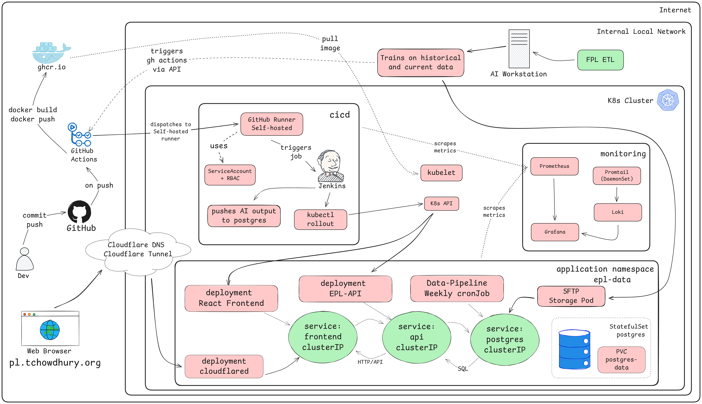

# EPL Data — Football Analytics
# (Live at https://pl.tchowdhury.org)

End‑to‑end football analytics pipeline: **Understat and FBRef → ETL → PostgreSQL → Flask API → React dashboard**, built and operated on **Kubernetes** with CI/CD, observability, and network policies.

> This README documents **what I built and how it’s deployed**

---

## Live
- **App:** https://pl.tchowdhury.org

---

## High‑Level Overview

- **Data**: Scraped from **Understat** via a custom ETL.
- **Storage**: **PostgreSQL 17** in Kubernetes via a **StatefulSet** + **PVC**.
- **API**: **Flask** service exposing football data + Prometheus metrics.
- **UI**: **React** (built with Vite, served by Nginx) for dashboards and visualizations.
- **CI/CD**: GitHub Actions builds component images → GHCR; a **self‑hosted GitHub Runner** in‑cluster triggers **Jenkins** to roll out the updated deployment.
- **Ingress/Edge**: Exposed through **Cloudflare Tunnel** (in‑cluster `cloudflared` pod).
- **Observability**: **Prometheus Operator**, **Grafana**, **Loki** + **Promtail**.
- **Security & Policy**: Non‑root containers, seccomp, read‑only filesystems (where possible), **Kubernetes NetworkPolicies** to enforce only the required paths.

---

## Architecture

---
## New Feature — FPL Predictions

I've added a **Fantasy Premier League (FPL) predictions module** to the pipeline.  
This feature trains on **over 150,000 rows** of historical + current player data with **30+ engineered parameters** to predict how many points a player might score in the **next gameweek**.

### Models
The system trains and validates **four different machine learning models**, letting you compare their results:

- **LightGBM** — gradient boosting on decision trees, efficient for large tabular datasets and useful for modeling complex interactions between features such as player form, fixtures, and team strength.  
- **XGBoost** — another gradient boosting algorithm, often delivering strong predictive performance in structured data competitions; in the FPL context, it helps capture non-linear relationships between player stats and expected points.  
- **PyTorch MLP (Multi-Layer Perceptron)** — a deep learning feed-forward neural network, which can model complex non-linearities in FPL data beyond gradient boosting approaches.  
- **PyTorch LSTM (Long Short-Term Memory)** — a recurrent neural network suited for sequential/time-series data, making it valuable for learning from player and team trends across multiple gameweeks.

These models provide **different perspectives on FPL player performance**, and results can be compared side-by-side to evaluate predictive confidence.

### Deployment Flow
Given the computational intensity of training these models, the pipeline **offloads training to a more powerful workstation**:

1. **Training & Validation**: heavy compute node trains/validates the models on historical/current data.  
2. **Artifact Storage**: trained model outputs are uploaded to an **SFTP storage pod** deployed inside the Kubernetes cluster.  
3. **Automation Trigger**: the upload triggers a **GitHub Action**, which in turn triggers a **Jenkins job**.  
4. **Database Update**: Jenkins retrieves artifacts from the SFTP pod and loads them into **PostgreSQL**.  
5. **API Exposure**: the predictions are then served via the existing **Flask API**, making them accessible to the **React dashboard**.

This design ensures that **resource-intensive ML workloads** run on hardware suited for training, while the cluster remains optimized for **serving results** efficiently and reliably.

---
## Frontend

**Component**: `epl-react` (Deployment, 2 replicas)  
**Service**: `ClusterIP :80` → pod `:8080` (Nginx serves built assets)

**Highlights**
- **Probes**: readiness & liveness against `/`.
- **Security**: `runAsNonRoot`, `seccomp: RuntimeDefault`, `readOnlyRootFilesystem: true`, no privilege escalation.
- **Resources**: requests `200m / 512Mi`, limits `1 CPU / 1Gi`.
- **Init dependency**: waits for API readiness (`/readyz`) before starting.
- **NetworkPolicy**
  - **Ingress**: only **from** pods labeled `app=cloudflared` on TCP **8080**.
  - **Egress**: DNS (CoreDNS in `kube-system`) + HTTP to `epl-api:8000`.

---

## Backend (API)

**Component**: `epl-api` (Deployment, 2 replicas)  
**Service**: `ClusterIP :8000`  
**Purpose**: Query layer for the dashboard with pagination & filtering; exposes Prometheus metrics.

**Highlights**
- **Config** via `ConfigMap`
- **Cache** WeeklyTableRanking is calculated and cached in memory(updated weekly) for faster response time.
- **Probes**: `/health` (liveness), `/readyz` (readiness).
- **Metrics**: `/metrics` (Prometheus, multiprocess enabled with `PROMETHEUS_MULTIPROC_DIR`).
- **Security**: `runAsNonRoot`, `readOnlyRootFilesystem`, `seccomp`, no privilege escalation.
- **Init container**: waits for Postgres DNS & connection (`pg_isready`).
- **Resources**: requests `500m / 512Mi`, limits `1 CPU / 1Gi`.
- **NetworkPolicy**
  - **Ingress**: from `epl-react` and Prometheus (in `monitoring` ns) to port **8000**.
  - **Egress**: DNS + Postgres **5432**.

**Prometheus Operator**
- `ServiceMonitor` (in `monitoring` ns) selects the `epl-api` Service (`port: http`, `path: /metrics`, interval 15s).

---

## Database (PostgreSQL)

**Component**: `postgres` (StatefulSet, 1 replica)  
**Storage**: `PVC epl-data-volume-claim` backed by a `hostPath` PV (demo/dev); `Retain` policy.  
**Services**: Headless (`postgres-hl`) + Client `ClusterIP` (`postgres`).

**Highlights**
- **ConfigMap** contains `postgresql.conf` tuning (buffers, WAL, autovacuum, etc.).
- **Security**: `runAsNonRoot` (UID/GID 999), `seccomp`, no priv‑esc.
- **Probes**: readiness/liveness with `pg_isready`.
- **Init container**: optional `fix-perms` to chown the hostPath on first run.
- **Resources**: requests `250m / 512Mi`, limits `1 CPU / 2Gi`.
- **PDB**: `minAvailable: 1`.
- **NetworkPolicy (ingress)**: only from `epl-api` and `etl-jobs` on **5432**.

> Note: `hostPath` pins data to one node; for HA or multi‑node portability, swap to a CSI storage class.

---

## Data Pipeline (ETL)

**Images**: `ghcr.io/tamhid92/epl-etl`  
**Modes**
- **Init Job** (`etl-init`): one‑time backfill.
- **Weekly CronJob** (`etl-weekly`): scheduled `0 3 * * 1` (Mondays 03:00).

**Behavior**
- Both wait for Postgres (`pg_isready`) before running.
- **Security**: CronJob runs non‑root; init Job allows root where needed (e.g., file writes).

---

## CI/CD Flow

**Trigger**: Git push/PR to repo  
**Build**: GitHub Actions detects changed paths:
- `frontend/**` → build/push `ghcr.io/tamhid92/epl-frontend-react`
- `backend/api/**` → build/push `ghcr.io/tamhid92/epl-api`
- `backend/data-pipeline/**` → build/push `ghcr.io/tamhid92/epl-etl`

**Publish**: Images pushed to **GHCR**.  
**Dispatch**: GA connects to the **self‑hosted GitHub Runner** inside the cluster.  
**Deploy**: Runner triggers **Jenkins** job → executes rollout:
- `kubectl set image` or `kubectl rollout` on only the affected Deployment.
- `kubectl rollout status` for health‑gated deployment.
- Nodes **pull** images from GHCR; K8s performs a **rolling update**.

---

## Observability & Logging

- **Prometheus** (+ Operator) scrapes API metrics via `ServiceMonitor`.
- **Grafana** dashboards visualize app and cluster metrics.
- **Loki + Promtail**: cluster logs are shipped to Loki (Promtail as DaemonSet).
- API exposes request/DB metrics; logs are JSON and container‑stdout friendly.

---

## Security & Policies

- **Containers**: run as non‑root, `seccomp: RuntimeDefault`, `allowPrivilegeEscalation: false`, `readOnlyRootFilesystem` where possible.
- **Secrets**: DB password via `Secret`, API token via `Secret`.
- **NetworkPolicies**:
  - **Frontend ingress**: only from `cloudflared` (TCP 8080).
  - **Frontend egress**: DNS + API:8000.
  - **API ingress**: from `epl-react` + Prometheus (monitoring).
  - **API egress**: DNS + Postgres:5432.
  - **Postgres ingress**: from API & ETL only.
- **Resource governance**: requests/limits on all workloads; graceful termination with probes.

---

## Notes & Credits

- Data scraping uses **Understat** and **FBRef** for educational/personal analysis purposes; scraping cadence is respectful.
- Thanks to the open‑source community around Prometheus/Grafana/Loki for tooling and dashboards.

## License

MIT
